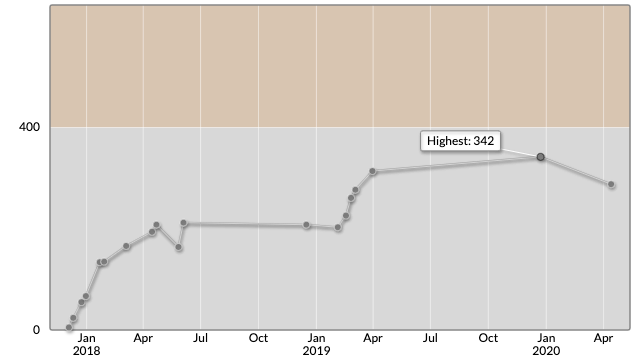

# AtCoder Beginner Contest 162

会場: https://atcoder.jp/contests/abc162  
公式解説放送: -

自分の提出: https://atcoder.jp/contests/abc162/submissions?f.User=murnana  
自分の成績表: https://atcoder.jp/users/murnana/history/share/abc162

## 参加後実績

|                    |                 |
| -----------------: | :-------------- |
|               順位 | 20230th         |
|             Rating | 342 → 288 (-54) |
|       Rating最高値 | 342 ― 9 級      |
| コンテスト参加回数 | 19              |

