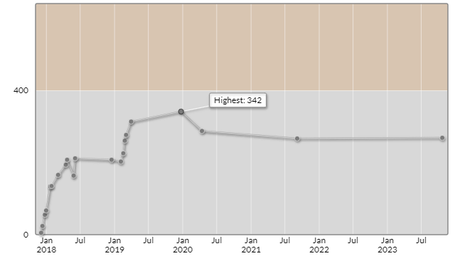

# キーエンスプログラミングコンテスト2023秋（AtCoder Beginner Contest 325）

会場: https://atcoder.jp/contests/abc325
公式解説放送: -

自分の提出: -  
自分の成績表: -

## 参加後実績

|                    |      |
| -----------------: | :--- |
|               順位 | -    |
|             Rating | -    |
|       Rating最高値 | -    |
| コンテスト参加回数 | -    |

