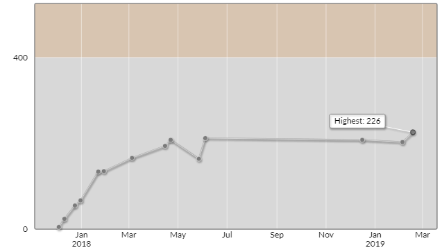

# AtCoder Beginner Contest 118

会場: https://atcoder.jp/contests/abc118  
公式解説放送: https://youtu.be/qBxvXX5hkAA?t=708

自分の提出: https://atcoder.jp/contests/abc118/submissions?f.User=murnana

## 参加後実績

|                    |             |
| -----------------: | :---------- |
|               順位 | 13411th     |****
|             Rating | 226         |
|       Rating最高値 | 226 ― 10 級 |
| コンテスト参加回数 | 14          |

## 解けなかった問題の解説メモ

### C - Monsters Battle Royale

https://atcoder.jp/contests/abc118/tasks/abc118_c

* 共通の約数のうち、最大のもの
  ｰ> 最大公約数
* 最大公約数の求め方: ユークリッドの互除法
  * ユークリッドの互除法はよくわからないので別ページにまとめる
