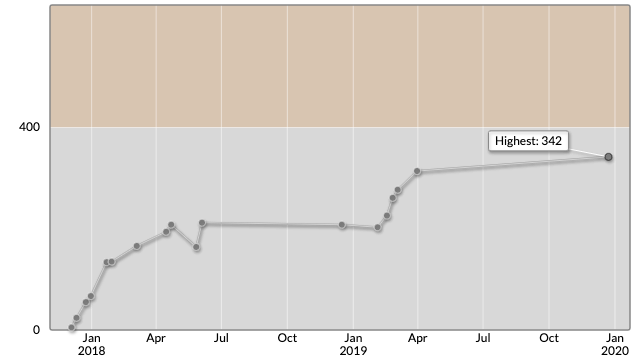

# AtCoder Beginner Contest 148

会場: https://atcoder.jp/contests/abc148  
公式解説放送: https://www.youtube.com/watch?v=F2p_e6iKxnk&feature=youtu.be

自分の提出: https://atcoder.jp/contests/abc148/submissions?f.User=murnana  
自分の成績表: https://atcoder.jp/users/murnana/history/share/abc148

## 参加後実績

|                    |                               |
| -----------------: | :---------------------------- |
|               順位 | 3172nd / 5375                 |
|             Rating | 314 → 342 (+28) Highest更新！ |
|       Rating最高値 | 342 ― 9 級                    |
| コンテスト参加回数 | 18                            |

