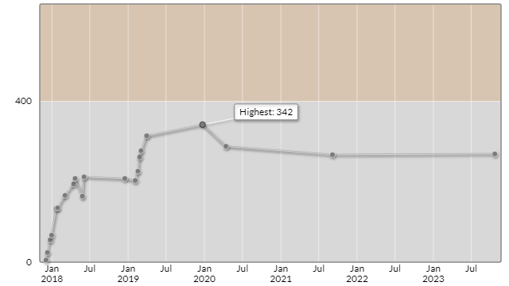

# キーエンスプログラミングコンテスト2023秋（AtCoder Beginner Contest 325）

会場: https://atcoder.jp/contests/abc325
公式解説放送: -

自分の提出: https://atcoder.jp/contests/abc325/submissions?f.User=murnana
自分の成績表: https://atcoder.jp/users/murnana/history/share/abc325

## 参加後実績

|                    |                 |
| -----------------: | :-------------- |
|               順位 | 5835th          |
|             Rating | 288 -> 269 (+2) |
|       Rating最高値 | 342 - 9級       |
| コンテスト参加回数 | 21              |

## フォルダ構成について

- _.\/Rated-AC_ … コンテスト中、AC (正解) したコード
