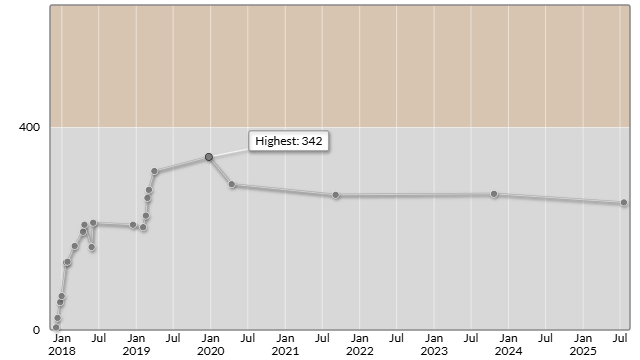

# 日本レジストリサービス（JPRS）プログラミングコンテスト2025#2（AtCoder Beginner Contest 415）

会場: https://atcoder.jp/contests/abc415  

自分の提出: https://atcoder.jp/contests/abc415/submissions?f.User=murnana 
自分の成績表: https://atcoder.jp/users/murnana/history/share/abc415

## 参加後実績

|                    |                 |
| -----------------: | :-------------- |
|               順位 | 8996th          |
|             Rating | 269 → 252 (-17) |
|       Rating最高値 | 342 ― 9 級      |
| コンテスト参加回数 | 22              |

