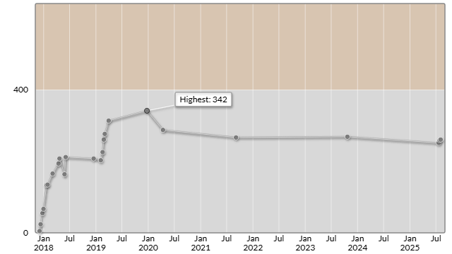

# AtCoder Beginner Contest 417

会場: [AtCoder Beginner Contest 417 - AtCoder](https://atcoder.jp/contests/abc417)

自分の提出: https://atcoder.jp/contests/abc417/submissions?f.User=murnana 
自分の成績表: https://atcoder.jp/users/murnana/history/share/abc417

## 参加後実績

|                    |                 |
| -----------------: | :-------------- |
|               順位 | 8191th          |
|             Rating | 259 → 261 (+2) |
|       Rating最高値 | 342 ― 9 級      |
| コンテスト参加回数 | 24              |

