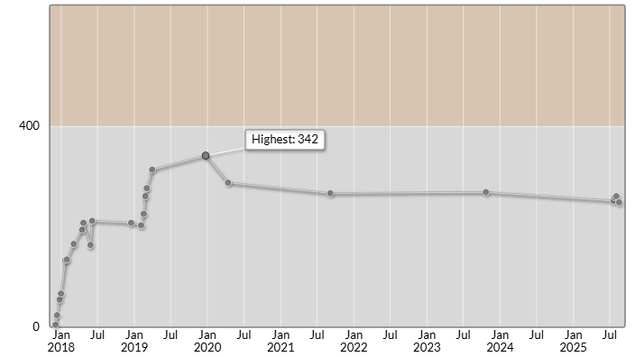

# AtCoder Beginner Contest 419

会場: [AtCoder Beginner Contest 419 - AtCoder](https://atcoder.jp/contests/abc419)

自分の提出: https://atcoder.jp/contests/abc419/submissions?f.User=murnana
自分の成績表: https://atcoder.jp/users/murnana/history/share/abc419

## 参加後実績

### 言語環境
* C# 11.0
* .NET 7.0.7

|                    |                 |
| -----------------: | :-------------- |
|               順位 | 43317th         |
|             Rating | 261 → 249 (-12) |
|       Rating最高値 | 342 ― 9 級      |
| コンテスト参加回数 | 25              |

