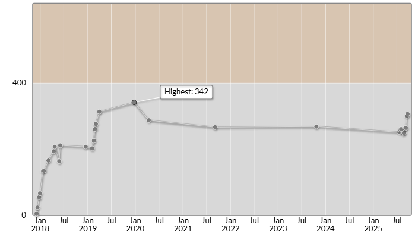

# AtCoder × Engineer Guild オンサイトコンテスト ～集結！高レート人材～予選（AtCoder Beginner Contest 424）

会場: [AtCoder × Engineer Guild オンサイトコンテスト ～集結！高レート人材～予選（AtCoder Beginner Contest 424）](https://atcoder.jp/contests/abc424)

自分の提出: https://atcoder.jp/contests/abc424/submissions?f.User=murnana
自分の成績表: https://atcoder.jp/users/murnana/history/share/424

## 参加後実績

### 言語環境
* C# 11.0
* .NET 7.0.7

|                    |                 |
| -----------------: | :-------------- |
|               順位 | 5903rd / 9795  |
|             Rating | 301 → 307 (+6) |
|       Rating最高値 | 342 ― 9 級      |
| コンテスト参加回数 | 30              |

