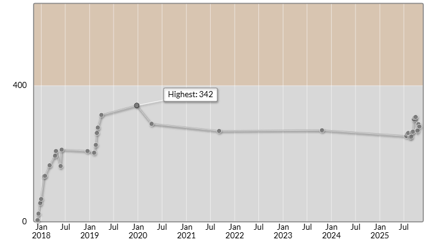

# Polaris.AI プログラミングコンテスト 2025（AtCoder Beginner Contest 429）

会場: [Polaris.AI プログラミングコンテスト 2025（AtCoder Beginner Contest 429） - AtCoder](https://atcoder.jp/contests/abc429)

自分の提出: https://atcoder.jp/contests/abc429/submissions?f.User=murnana
自分の成績表: https://atcoder.jp/users/murnana/history/share/abc429

## 参加後実績

|                    |                |
| -----------------: | :------------- |
|               順位 | 7711th / 11184 |
|             Rating | 287 → 280 (-7) |
|       Rating最高値 | 342 ― 9 級     |
| コンテスト参加回数 | 34             |
|               AC数 | 2問 (A, B)     |

## 解いた問題

### A - Too Many Requests

https://atcoder.jp/contests/abc429/tasks/abc429_a

- N回のリクエストのうち、M回目までは "OK"、それ以降は "Too Many Requests" を出力
- 単純なループ処理で実装
- i <= M の条件で分岐

### B - N - 1

https://atcoder.jp/contests/abc429/tasks/abc429_b

- 配列の合計から各要素を引いた値がMと一致するか判定
- 全要素の合計を先に計算しておき、各要素を引いた値と比較
- 一致するものが見つかれば "Yes"、見つからなければ "No"

## 未挑戦・解けなかった問題

### C - Odd One Subsequence

https://atcoder.jp/contests/abc429/tasks/abc429_c

- 辞書を使って同じ数値のインデックスをグループ化するアプローチを試行
- ペアの組み合わせを数える実装を試みたが、O(N²)の計算量になりTLEが懸念された
- 時間内に最適化できず未提出
- `C-unsubmitted.cs`: 解きかけのコード

**Upsolving (2025-10-26):**
- 公式解説を参考に組み合わせ論によるO(N)解法を実装
- 各値xの出現回数B_xから、C(B_x, 2) × (N - B_x) で3つ組を計算
- 詳細なインライン解説を追加し、数式の意味を具体例で説明
- AC達成: https://atcoder.jp/contests/abc429/submissions/70486173
- `upsolving/C.cs`: 復習後の解法（詳細コメント付き）

### D問題以降

- 時間切れのため未挑戦
