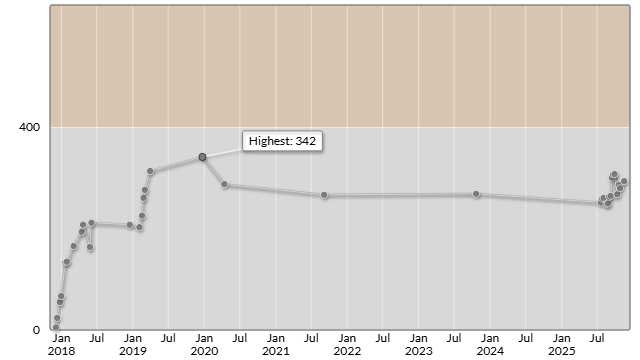

# オムロン株式会社プログラミングコンテスト2025 #2（AtCoder Beginner Contest 432）

会場: [オムロン株式会社プログラミングコンテスト2025 #2（AtCoder Beginner Contest 432） - AtCoder](https://atcoder.jp/contests/abc432)

自分の提出: https://atcoder.jp/contests/abc432/submissions?f.User=murnana  
自分の成績表: https://atcoder.jp/users/murnana/history/share/abc432

## 参加後実績

### 言語環境
* C# 13.0
* .NET 9.0.8 (Native AOT)

|                    |                 |
| -----------------: | :-------------- |
|               順位 | 5874th / 10,475 |
|        Performance | 438             |
|             Rating | 280 → 294 (+14) |
|       Rating最高値 | 342 ― 9 級      |
| コンテスト参加回数 | 35              |
|               AC数 | 2問 (A, B)      |

## 解いた問題

### A - Permute to Maximize

https://atcoder.jp/contests/abc432/tasks/abc432_a

- 問題文を理解してACを取得

### B - Permute to Minimize

https://atcoder.jp/contests/abc432/tasks/abc432_b

- 問題文を理解してACを取得

## 未挑戦・解けなかった問題

### C - Candy Tribulation

https://atcoder.jp/contests/abc432/tasks/abc432_c

- 問題文が理解できず断念

### D - Suddenly, A Tempest

https://atcoder.jp/contests/abc432/tasks/abc432_d

- 問題文が理解できず断念

### E - Clamp

https://atcoder.jp/contests/abc432/tasks/abc432_e

- 問題文が理解できず断念

### F - Candy Redistribution

https://atcoder.jp/contests/abc432/tasks/abc432_f

- 問題文が理解できず断念

### G - Sum of Binom(A, B)

https://atcoder.jp/contests/abc432/tasks/abc432_g

- 問題文が理解できず断念
