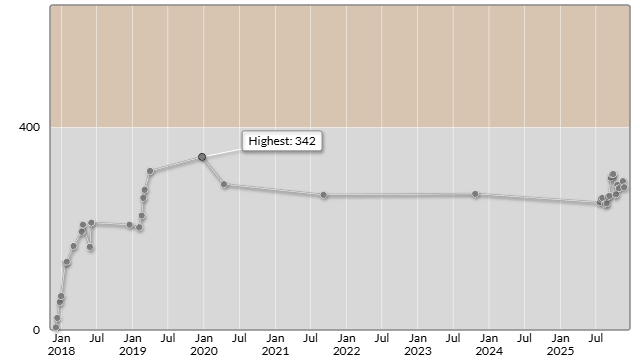

# パナソニックグループプログラミングコンテスト2025（AtCoder Beginner Contest 433）

会場: [パナソニックグループプログラミングコンテスト2025（AtCoder Beginner Contest 433） - AtCoder](https://atcoder.jp/contests/abc433)

自分の提出: https://atcoder.jp/contests/abc433/submissions?f.User=murnana
自分の成績表: https://atcoder.jp/users/murnana/history/share/abc433

## 参加後実績

### 言語環境
* C# 13.0
* .NET 9.0.8 (Native AOT)

|                    |                 |
| -----------------: | :-------------- |
|               順位 | 8810th / 12,219 |
|        Performance | 186             |
|             Rating | 294 → 282 (-12) |
|       Rating最高値 | 342 ― 9 級      |
| コンテスト参加回数 | 36              |
|               AC数 | 1問 (B)         |

## 解いた問題

### B - Nearest Taller

https://atcoder.jp/contests/abc433/tasks/abc433_b

- 各要素について、それより大きい要素を左から探索
- `List<byte>.FindLastIndex`を使用して効率的に検索
- 見つからない場合は -1、見つかった場合はインデックス+1を出力

## 未挑戦・解けなかった問題

### A - Happy Birthday! 4

https://atcoder.jp/contests/abc433/tasks/abc433_a

- 時間切れのため未提出

### C - 1122 Substring 2

https://atcoder.jp/contests/abc433/tasks/abc433_c

- 時間切れのため未提出

### D - 183183

https://atcoder.jp/contests/abc433/tasks/abc433_d

- 時間切れのため未提出

### E - Max Matrix 2

https://atcoder.jp/contests/abc433/tasks/abc433_e

- 時間切れのため未提出

### F - 1122 Subsequence 2

https://atcoder.jp/contests/abc433/tasks/abc433_f

- 時間切れのため未提出

### G - Substring Game

https://atcoder.jp/contests/abc433/tasks/abc433_g

- 時間切れのため未提出
