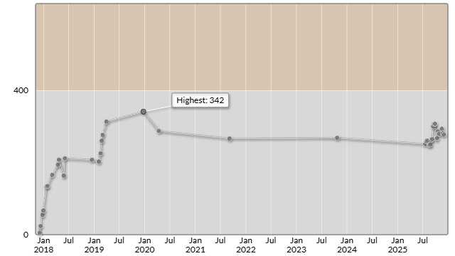

# Ｓｋｙ株式会社プログラミングコンテスト2025（AtCoder Beginner Contest 434）

会場: [Ｓｋｙ株式会社プログラミングコンテスト2025（AtCoder Beginner Contest 434） - AtCoder](https://atcoder.jp/contests/abc434)

自分の提出: https://atcoder.jp/contests/abc434/submissions?f.User=murnana
自分の成績表: https://atcoder.jp/users/murnana/history/share/abc434

## 参加後実績

### 言語環境
* C# 13.0
* .NET 9.0.8

|                    |                |
| -----------------: | :------------- |
|               順位 | 6319th / 9873  |
|        Performance | 250            |
|             Rating | 282 → 278 (-4) |
|       Rating最高値 | 342 ― 9 級     |
| コンテスト参加回数 | 37             |
|               AC数 | 2問 (A, B)     |

## 解いた問題

### A - Balloon Trip

https://atcoder.jp/contests/abc434/tasks/abc434_a

### B - Bird Watching

https://atcoder.jp/contests/abc434/tasks/abc434_b

## 未挑戦・解けなかった問題

### C - Flapping Takahashi

https://atcoder.jp/contests/abc434/tasks/abc434_c

- `C-unsubmitted.cs`: 解きかけのコード

**Upsolving (2025-11-30):**
- 高度制約を満たしながら飛行経路が実現可能かを判定する問題
- 各時点で到達可能な高度範囲 [L, U] を追跡するアプローチで解決
- 時間計算量: O(N)、空間計算量: O(1)
- AC submission: https://atcoder.jp/contests/abc434/submissions/71351987 (76ms, 5,800 KiB)
- `upsolving/C.cs`: 公式解説に基づく実装（詳細な日本語コメント付き）

### D問題以降

- 時間切れのため未挑戦
