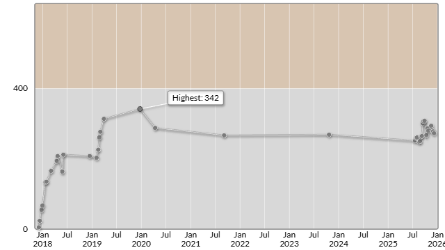

# パナソニックプログラミングコンテスト2025（AtCoder Beginner Contest 435）

会場: [パナソニックプログラミングコンテスト2025（AtCoder Beginner Contest 435） - AtCoder](https://atcoder.jp/contests/abc435)

自分の提出: https://atcoder.jp/contests/abc435/submissions?f.User=murnana
自分の成績表: https://atcoder.jp/users/murnana/history/share/abc435

## 参加後実績

### 言語環境
* C# 13.0
* .NET 9.0.8

|                    |                |
| -----------------: | :------------- |
|               順位 | 7994th / 11770 |
|        Performance | 233            |
|             Rating | 278 → 273 (-5) |
|       Rating最高値 | 342 ― 9 級     |
| コンテスト参加回数 | 38             |
|               AC数 | 2問 (A, B)     |

## 解いた問題

### A - Triangular Number

https://atcoder.jp/contests/abc435/tasks/abc435_a

### B - No-Divisible Range

https://atcoder.jp/contests/abc435/tasks/abc435_b

## 未挑戦・解けなかった問題

### C - Domino

https://atcoder.jp/contests/abc435/tasks/abc435_c

- 時間内に実装が完了せず未提出

### D問題以降

- 時間切れのため未挑戦
