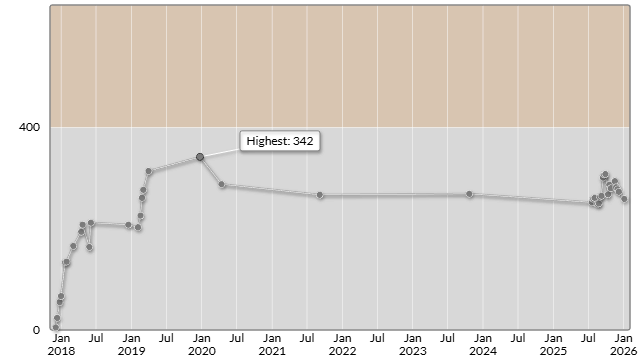

# AtCoder Beginner Contest 439 (Promotion of AtCoderJobs)

会場: [AtCoder Beginner Contest 439 (Promotion of AtCoderJobs) - AtCoder](https://atcoder.jp/contests/abc439)

自分の提出: https://atcoder.jp/contests/abc439/submissions?f.User=murnana
自分の成績表: https://atcoder.jp/users/murnana/history/share/abc439

## 参加後実績

### 言語環境
* C# 13.0
* .NET 9.0.8

|                    |                 |
| -----------------: | :-------------- |
|               順位 | 8026th / 10547  |
|        Performance | 152             |
|             Rating | 273 → 259 (-14) |
|       Rating最高値 | 342 ― 9 級      |
| コンテスト参加回数 | 39              |
|               AC数 | 1問 (A)         |

## 解いた問題

### A - 2^n - 2*n

https://atcoder.jp/contests/abc439/tasks/abc439_a

## 未挑戦・解けなかった問題

### B - Happy Number

https://atcoder.jp/contests/abc439/tasks/abc439_b

- ループ検出のロジックに問題があり、WA（不正解）
- `B-wa.cs`: 不正解だった提出コード

### C問題以降

- 時間切れのため未挑戦
