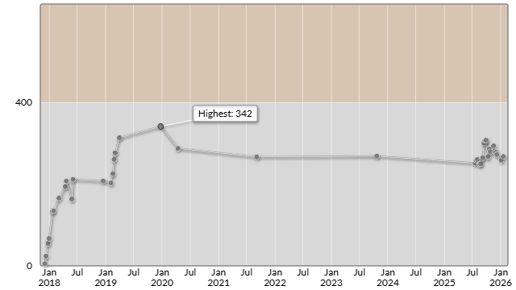

# AtCoder Beginner Contest 441 (Promotion of Engineer Guild Fes)

会場: [AtCoder Beginner Contest 441 (Promotion of Engineer Guild Fes) - AtCoder](https://atcoder.jp/contests/abc441)

自分の提出: https://atcoder.jp/contests/abc441/submissions?f.User=murnana
自分の成績表: https://atcoder.jp/users/murnana/history/share/abc441

## 参加後実績

### 言語環境
* C# 13.0
* .NET 9.0.8

|                    |                 |
| -----------------: | :-------------- |
|               順位 | 7444th / 12331  |
|        Performance | 362             |
|             Rating | 259 → 268 (+9)  |
|       Rating最高値 | 342 ― 9 級      |
| コンテスト参加回数 | 40              |
|               AC数 | 2問 (A, B)      |

## 解いた問題

### A - Black Square

https://atcoder.jp/contests/abc441/tasks/abc441_a

### B - Two Languages

https://atcoder.jp/contests/abc441/tasks/abc441_b

## 未挑戦・解けなかった問題

### C - Sake or Water

https://atcoder.jp/contests/abc441/tasks/abc441_c

**Upsolving (2026-01-18):**
- 累積和と貪欲法を用いた解法
- 容量の大きいカップから順に選択し、最悪ケースでの保証される日本酒量を計算
- 時間計算量: O(N log N)（ソート）、空間計算量: O(N)
- AC submission: https://atcoder.jp/contests/abc441/submissions/72576193
- `upsolving/C.cs`: 詳細なアルゴリズム解説とステップごとのデバッグ出力を含む実装

### D - Paid Walk

https://atcoder.jp/contests/abc441/tasks/abc441_d

### E - A > B substring

https://atcoder.jp/contests/abc441/tasks/abc441_e

### F - Must Buy

https://atcoder.jp/contests/abc441/tasks/abc441_f

### G - Takoyaki and Flip

https://atcoder.jp/contests/abc441/tasks/abc441_g
