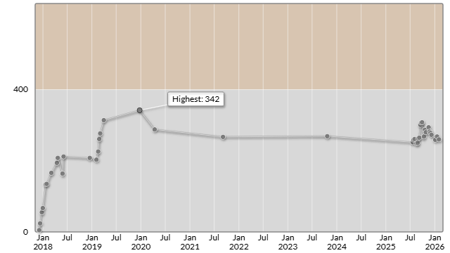

# Denso Create Programming Contest 2026 (AtCoder Beginner Contest 443)

会場: [Denso Create Programming Contest 2026 (AtCoder Beginner Contest 443) - AtCoder](https://atcoder.jp/contests/abc443)

自分の提出: https://atcoder.jp/contests/abc443/submissions?f.User=murnana
自分の成績表: https://atcoder.jp/users/murnana/history/share/abc443

## 参加後実績

### 言語環境
* C# 13.0
* .NET 9.0.8

|                    |                  |
| -----------------: | :--------------- |
|               順位 | 8513th / 11766   |
|        Performance | 189              |
|             Rating | 268 → 260 (-8)   |
|       Rating最高値 | 342 ― 9 級       |
| コンテスト参加回数 | 41               |
|               AC数 | 2問 (A, B)       |

## 解いた問題

### A - Append s

https://atcoder.jp/contests/abc443/tasks/abc443_a

### B - Setsubun

https://atcoder.jp/contests/abc443/tasks/abc443_b

## 未挑戦・解けなかった問題

### C - Chokutter Addiction

https://atcoder.jp/contests/abc443/tasks/abc443_c

### D - Pawn Line

https://atcoder.jp/contests/abc443/tasks/abc443_d

### E - Climbing Silver

https://atcoder.jp/contests/abc443/tasks/abc443_e

### F - Non-Increasing Number

https://atcoder.jp/contests/abc443/tasks/abc443_f

### G - Another Mod of Linear Problem

https://atcoder.jp/contests/abc443/tasks/abc443_g
