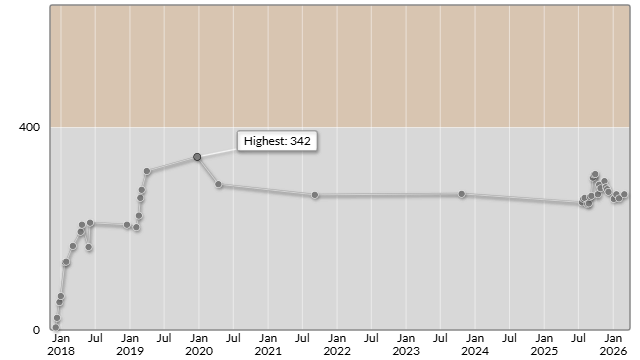

# AtCoder Beginner Contest 447

会場: [AtCoder Beginner Contest 447 - AtCoder](https://atcoder.jp/contests/abc447)

自分の提出: https://atcoder.jp/contests/abc447/submissions?f.User=murnana
自分の成績表: https://atcoder.jp/users/murnana/history/share/abc447

## 参加後実績

### 言語環境
* C# 13.0
* .NET 9.0.8

|                    |                |
| -----------------: | :------------- |
|               順位 | 6864th / 10735 |
|        Performance | 349            |
|             Rating | 260 → 268 (+8) |
|       Rating最高値 | 342 ― 9 級     |
| コンテスト参加回数 | 42             |
|               AC数 | 2問 (A, B)     |

## 解いた問題

### A - Seats 2

https://atcoder.jp/contests/abc447/tasks/abc447_a

### B - mpp

https://atcoder.jp/contests/abc447/tasks/abc447_b

## 未挑戦・解けなかった問題

### C - Insert and Erase A

https://atcoder.jp/contests/abc447/tasks/abc447_c

### D - Take ABC 2

https://atcoder.jp/contests/abc447/tasks/abc447_d

### E - Divide Graph

https://atcoder.jp/contests/abc447/tasks/abc447_e

### F - Centipede Graph

https://atcoder.jp/contests/abc447/tasks/abc447_f

### G - Div. 1 & Div. 2

https://atcoder.jp/contests/abc447/tasks/abc447_g
